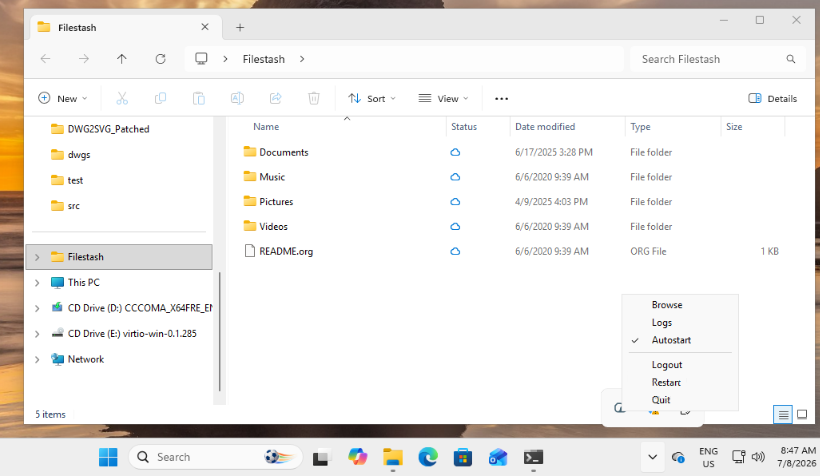

# What is fsync?

This is the native drive client using [Filestash](https://www.filestash.app) as a backend.

## Architecture

Ports and adapters. The core owns all policy, everything that decides *what moves where* lives there, once. Each platform crate adapts one filesystem technology to it.

| crate | technology |
|---|---|
| `fsync-core` | `Engine` (ledger, conflict rules, upload scheduler), the `LocalTree` port, the Filestash HTTP sdk |
| `fsync-linux` | FUSE, GTK |
| `fsync-windows` | Win32, CfAPI, ReadDirectoryChangesW, IShellWindows |
| `fsync-mac` | FileProvider |
| `fsync-ios` | FileProvider |
| `fsync-android` | Storage Access Framework (Kotlin wire, UniFFI) |

Two adapter families:

- **we are the filesystem** (linux, android, ios): online-first, listings answered live, content cached on open, edits pushed back by the core's scheduler; nothing durable beyond that cache.
- **the system owns the replica** (windows, mac): placeholders materialize on demand; the only durable local state is the spool of unpushed edits.

The model in one line: the filesystems are the state, the ledger is the memory of where local and remote last agreed, dirty is the debt owed upward, and conflicts are detected by comparing the server against that memory. Dirty wins locally; deletes and renames are verdicts (server first, a failure vetoes); a conflicting upload diverts to a "(conflicted copy)"; an unreadable ledger quarantines the cache instead of pruning it.
